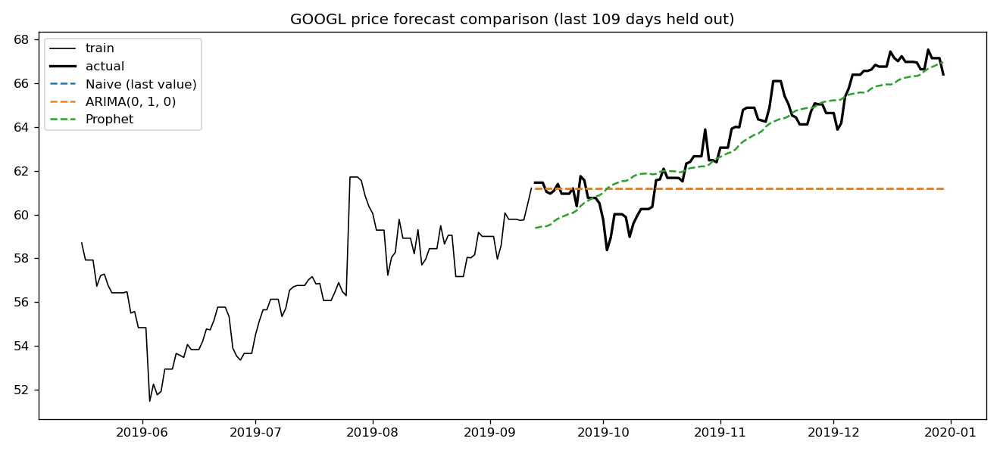
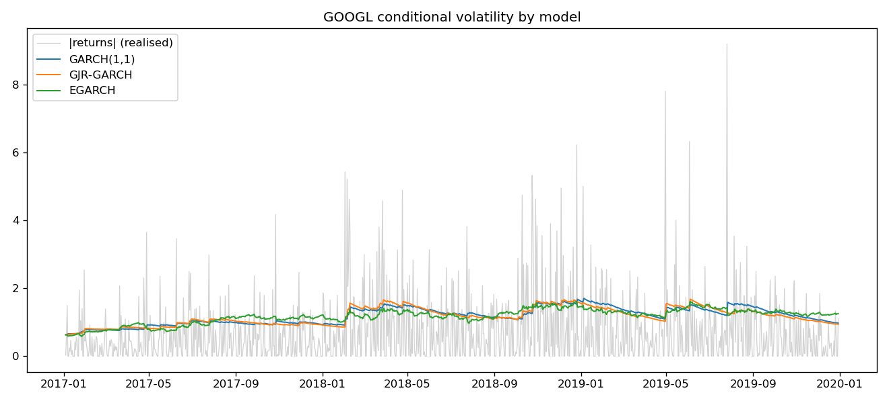

# Time Series Analysis

Time-series forecasting and volatility modelling across financial and
macroeconomic data. Stock prices come from Yahoo Finance (`yfinance`) and the
unemployment series from the FRED database via Nasdaq Data Link. The reusable
code lives in the `timeseries` package under `src/`; the notebooks are the
analysis narrative.

## Notebooks

- **`01_stock_price_forecasting.ipynb`** — stock price forecasting
  - Moving Average (MA), Autoregressive (AR), ARIMA
  - Grid search and Auto ARIMA for order selection
  - Prophet

- **`02_unemployment_forecasting.ipynb`** — US unemployment-rate forecasting (FRED/UNRATENSA)
  - Seasonal and STL decomposition
  - Stationarity testing (ADF, KPSS)
  - Exponential smoothing: Simple, Holt, Holt-Winters, Auto-ETS
  - ARIMA and Auto-SARIMA

- **`03_volatility_modelling.ipynb`** — stock-return volatility
  - Hurst exponent, GARCH(1,1)
  - Information asymmetry: GJR-GARCH, EGARCH
  - Volatility forecasting: fixed and expanding rolling windows
  - Simulation- and bootstrap-based forecasts
  - CCC-GARCH for portfolio volatility
  - Model evaluation

- **`04_walk_forward_validation.ipynb`** — out-of-sample evaluation
  - Expanding-window walk-forward backtest for ARIMA and GARCH
  - Per-horizon MAE / RMSE / MAPE and directional accuracy
  - Accuracy-degradation plots: how far ahead each model stays useful

## The `timeseries` package

The modelling code from the notebooks is factored into an importable package so it
can be reused and tested:

| Module | Contents |
|--------|----------|
| `data` | Yahoo Finance / FRED fetching (parquet-cached), return construction, ADF & KPSS stationarity tests, chronological split |
| `forecasting` | Seasonal & STL decomposition, exponential smoothing (SES / Holt / Holt-Winters / Auto-ETS), ARIMA, Auto-ARIMA/SARIMA, Prophet |
| `volatility` | Hurst exponent, GARCH / GJR-GARCH / EGARCH, ARMA+GARCH, rolling & expanding volatility forecasts, simulation forecasts, CCC-GARCH |
| `backtest` | Expanding-window walk-forward backtesting and per-horizon metrics |
| `evaluate` | Point-forecast metrics and GARCH variance-error scoring |

```python
from timeseries import fetch_stock, prepare_prices, walk_forward_arima, metrics_by_horizon

prices = prepare_prices(fetch_stock("GOOGL", "2017-01-01", "2019-12-31")["Close"])
backtest = walk_forward_arima(prices, order=(2, 1, 2), initial_train_size=800, horizon=5)
print(metrics_by_horizon(backtest))
```

## Model comparison

`scripts/run_comparison.py` runs every model on the **same series and the same
chronological split** so the numbers are comparable:

```
python scripts/run_comparison.py
```

It holds out the final 10% of the GOOGL 2017–2019 series and produces:

- **Level forecast** (price): a naive last-value baseline vs ARIMA (auto order) vs
  Prophet, scored by MAE / RMSE / MAPE and directional accuracy.
- **Volatility** (returns): GARCH(1,1) vs GJR-GARCH vs EGARCH, scored by variance
  error against realised variance, with AIC / BIC.

Outputs are written to `results/`: `comparison_level.csv`,
`comparison_volatility.csv`, `forecast_comparison.png`, `volatility_models.png`.

**Level forecast** — last 10% (108 days) of GOOGL held out:

| Model | MAE | RMSE | MAPE | Directional acc. |
|:--|:--:|:--:|:--:|:--:|
| Naive (last value) | 2.78 | 3.43 | 4.27% | 0.31 |
| ARIMA(0, 1, 0) | 2.78 | 3.43 | 4.27% | 0.31 |
| Prophet | **0.88** | **1.08** | **1.40%** | 0.32 |



**Volatility** — GARCH family on the returns (lower variance error / AIC / BIC is better):

| Model | Variance MAE | Variance MSE | AIC | BIC |
|:--|:--:|:--:|:--:|:--:|
| GARCH(1,1) | 1.915 | 22.17 | 3411.2 | 3431.2 |
| GJR-GARCH | **1.895** | 22.01 | **3390.0** | **3414.9** |
| EGARCH | 1.896 | **21.98** | 3395.6 | 3420.6 |



### Key findings

- **A random-walk ARIMA *is* the naive baseline.** `auto_arima` selected
  ARIMA(0, 1, 0) on the price, and its forecast is identical to the naive
  last-value baseline to four decimals — the model itself concludes that the best
  estimate of every future day is the last observed price.
- **Prophet wins on level error but not on direction.** Prophet's trend component
  cuts RMSE from 3.43 to 1.08 over the long hold-out, yet its directional accuracy
  (0.32) is no better than the random walk's. Fitting the trend is not the same as
  predicting which way the price moves next.
- **The directional edge decays fast.** Walk-forward validation (notebook 04, 22
  expanding-window origins) shows the price-forecast error growing with the horizon
  while directional accuracy falls to zero past two days:

  | Horizon (days) | RMSE | MAPE | Directional accuracy |
  |:--:|:--:|:--:|:--:|
  | 1 | 0.61 | 0.68% | 0.32 |
  | 2 | 1.37 | 1.27% | 0.18 |
  | 3 | 1.42 | 1.59% | 0.00 |
  | 4 | 1.47 | 1.73% | 0.00 |
  | 5 | 1.49 | 1.83% | 0.00 |

- **Asymmetry pays off in volatility.** GJR-GARCH has the lowest AIC, BIC, and
  variance MAE, and EGARCH the lowest variance MSE; plain GARCH(1,1) is worst on
  every criterion. The leverage term — "bad news raises volatility more than good
  news" — earns its extra parameter here. And because variance is persistent, the
  volatility forecast stays stable across the horizon instead of compounding the
  way the price error does.

## Install

```
pip install -e .            # core
pip install -e ".[extras]"  # + Prophet and sktime (Auto-ETS)
pip install -e ".[dev]"     # + pytest, ruff
```

## Configuration

`02_unemployment_forecasting.ipynb` (and `fetch_fred`) read a Nasdaq Data Link API
key from a local `config.py` (gitignored):

```python
NASDAQ = "your-api-key"
```
